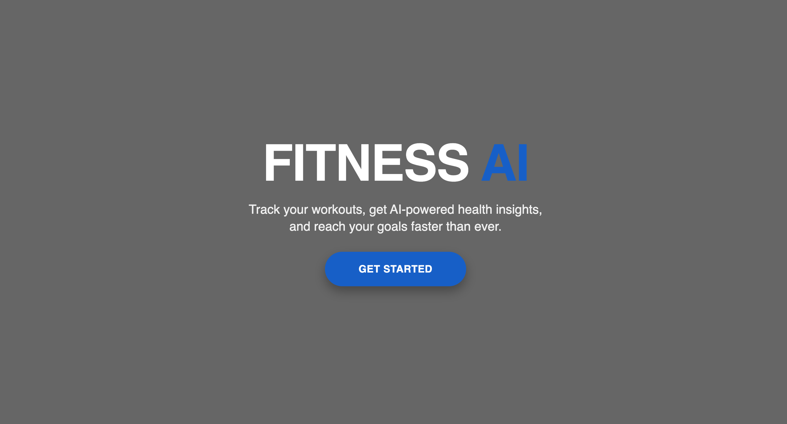
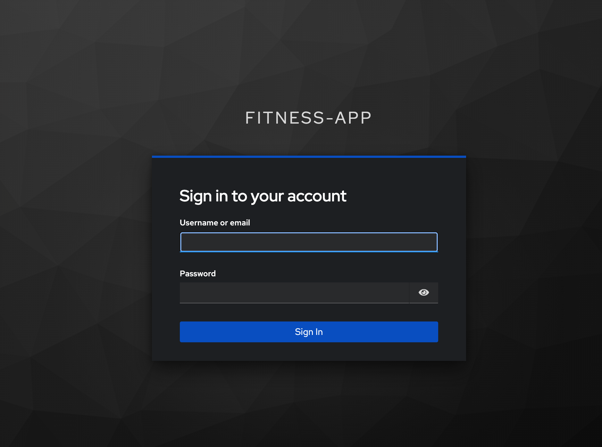
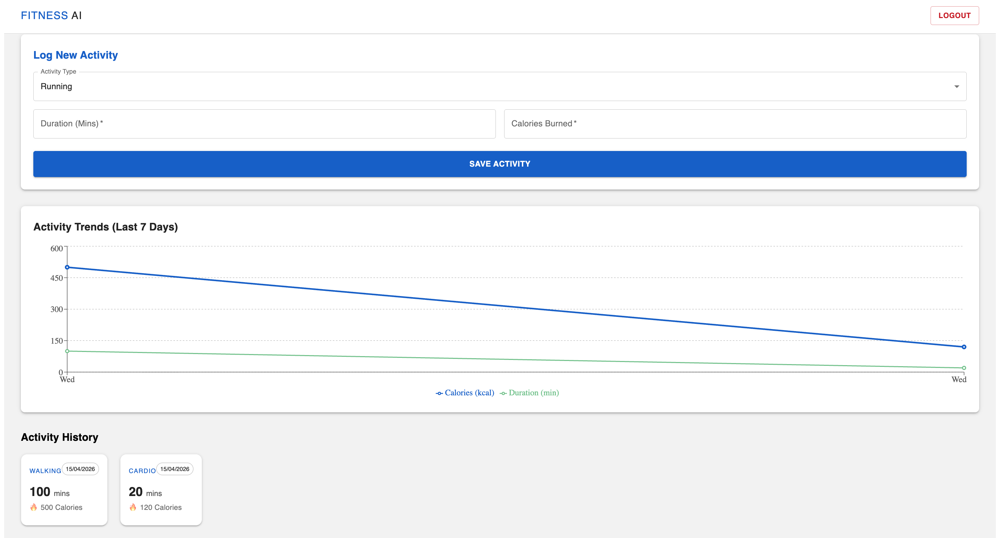
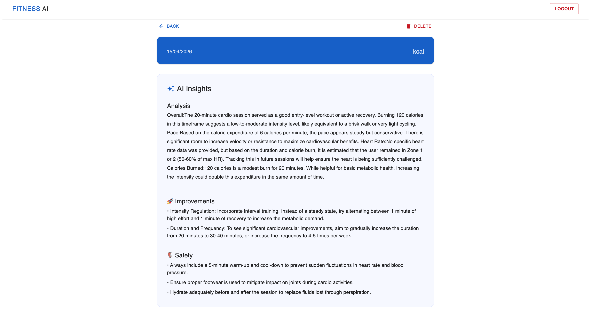

# 🏋️ Fitness AI – Microservices-Based Fitness Tracking System

Fitness AI is a **full-stack microservices application** that allows users to track workouts and receive **AI-powered insights** based on their activity data.

---

## 📸 Application Preview

### 🏠 Landing Page


### 🔐 Login Page


### 📊 Dashboard & 📈 Activity Trends


### 🤖 AI Insights


---

## 🚀 Features

- 🔐 Secure authentication using Keycloak (OAuth2 + PKCE)
- 🏋️ Log fitness activities (type, duration, calories)
- 📊 Visualize activity trends using charts
- 🤖 AI-powered workout insights and recommendations
- 📡 Event-driven communication using Kafka

---

## 🏗️ Architecture Overview

### 🔹 Backend (Microservices)

- API Gateway → Handles routing & authentication  
- Eureka Server → Service discovery  
- Config Server → Centralized configuration  
- User Service → Manages user data (**PostgreSQL**)  
- Activity Service → Stores activity data (**MongoDB**)  
- AI Service → Processes Kafka events & generates insights  

---

## 🔄 Event Flow

```
User → Activity Service → Kafka → AI Service → Gemini API → Frontend
```

---

## 🛠️ Tech Stack

### Backend:
- Java 25  
- Spring Boot  
- Spring Cloud (Gateway, Eureka, Config)  
- Apache Kafka  
- PostgreSQL (User Service)  
- MongoDB (Activity Service)  
- Keycloak (OAuth2)  

### Frontend:
- React (Vite)  
- Redux Toolkit  
- Material UI (MUI)  
- Recharts  

---

## 📂 Project Structure

```
fitness-ai/
│
├── gateway/                # API Gateway & security filter
├── eureka-server/         # Service registry
├── config-server/         # Centralized configuration
├── user-service/          # User management (PostgreSQL)
├── activity-service/      # Activity tracking (MongoDB + Kafka Producer)
├── ai-service/            # AI processing (Kafka Consumer + Gemini)
├── fitness-frontend/      # React frontend
│
└── screenshots/           # Project screenshots
```

---

## ▶️ How to Run

### 1. Start Infrastructure

```
Start Keycloak (Port 8181)
Start Kafka & Zookeeper
Start PostgreSQL
Start MongoDB
```

### 2. Start Services (Order Matters)

```
eureka-server
config-server
gateway
user-service
activity-service
ai-service
```

### 3. Run Frontend

```
cd fitness-frontend
npm install
npm run dev
```

---

## 💡 Key Learnings

- Microservices architecture using Spring Boot  
- Event-driven systems using Kafka  
- Handling multiple databases (PostgreSQL + MongoDB)  
- Secure authentication with OAuth2 + PKCE  
- Integrating AI (Gemini API) into backend services  
- State management using Redux Toolkit  

---

## 📌 Future Improvements

```
- Add real-time notifications using WebSockets
- Improve AI recommendations using user history
- Dockerize all services for deployment
- Add CI/CD pipeline (GitHub Actions)
- Implement unit & integration testing
```

---

## 👨‍💻 Author

**Yash Shelar**
